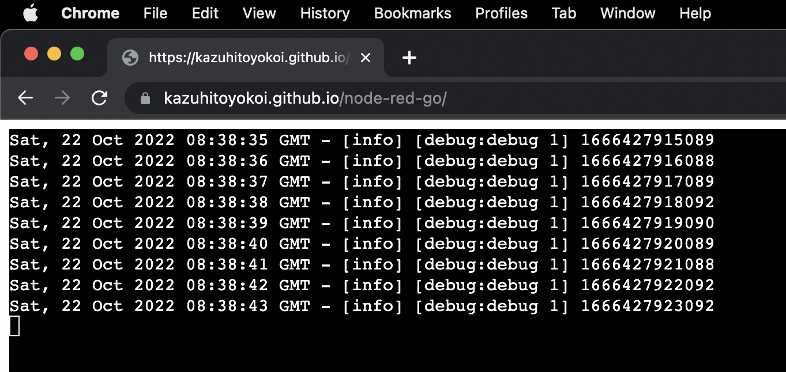

# Node-RED runtime for WebAssembly

## Demonstration
- Console log
https://kazuhitoyokoi.github.io/node-red-wasm

- ISS location map
https://kazuhitoyokoi.github.io/node-red-wasm/worldmap.htm

## How to use
